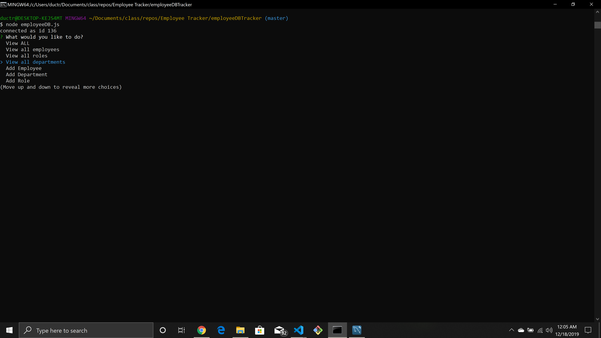
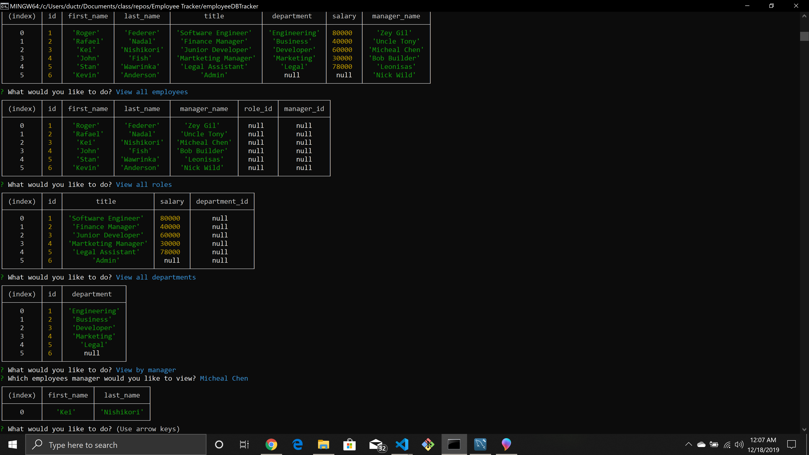

# Employee Database

#### Purpose

The purpose of this project is learn and understand mysql, creating a table, inserting values, updating values based on different table, deleting values, viewing different tables, and most important of all, understanding how join works and using the correct join according when necessary.

#### Functionality

The functionality is to create a database with multiple columns and know how to select values or columns from each table. Also we can input values dynamically or deleting values dynamicall so that everytime we update something we dont have to do that for every single row on the table.

#### Testing on Node.js

#### Results on Node.js

